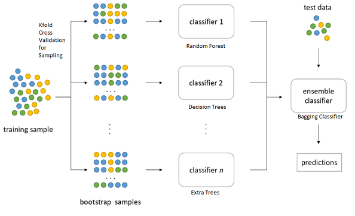
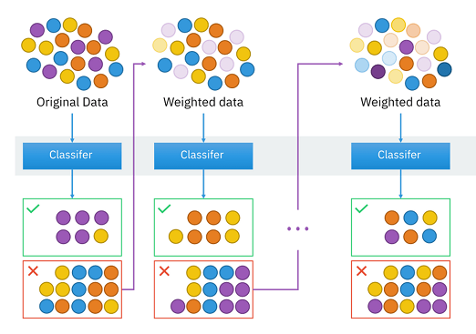
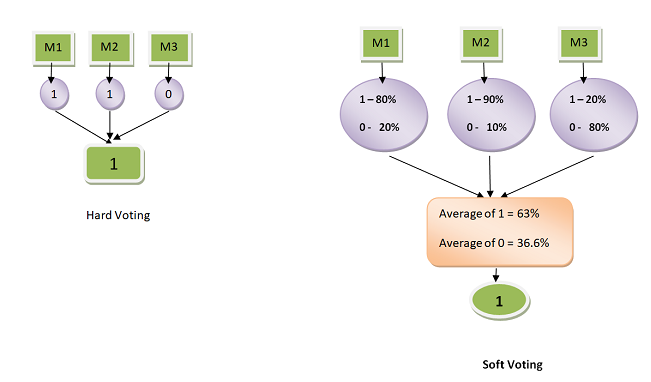

# Ensemble-Learning

## Random Forest

Birden fazla Decision Tree'den oluşan bir ensemble learning algoritmasıdır.

Veri seti  train ve test olarak ayrıldıktan sonra, train veri setinden seçilen veriler subset'ler olarak ayırılır. Bu işleme Bootstrapping denilir. Daha sonra her subset için bir Decision Tree Classifier kullanılır. n adet eğitilmiş Decision Tree, ensemble classifier'ı oluşturur. Test veri setine ensemble classifier yani içerideki n adet Decision Tree uygulanır ve her bir tree'den bir sonuç elde edilir. Elde edilen sonuçlarda en çok çıkan sınıf test verisinin sınıfını belirler. Bu işleme Aggregating denilir. Tüm bu adımların genel adı BAGGING olarak belirlenmiştir. 

## AdaBoost

Adaptive Boosting olarak da bilinen AdaBoost, tahmine dayalı modelleme algoritmalarından biridir. AdaBoost tek seviyeli, bir node ve iki leaf'tan oluşan karar ağaçlarından oluşur ve bunlara "Stump" denilir. Stump'lar bir önceki stump'ın sonucunda çıkan stump error'ü düşürmeye çalışır. Bu sayede model ağırlıkları en iyiye ulaşana kadar güncellenir ve yanlış kategorize edilen noktalara daha büyük ağırlıklar uygulanır. Doğru kategorize edilen noktaların ağırlıkları ise azaltılır. 

## Voting Classifier

Voting classifier, içerisinde birden fazla sınıflandırıcı bulundurarak çalışır. Her sınıflandırıcıdan çıkan sonuca bakarak en yüksek değere sahip class verinin class'ı olarak belirlenir. İki türde voting classifier bulunur bunlar Hard ve Soft Voting Classifier'dır. Hard Voting'in sonucu tam sayı olarak çıkarken, Soft Voting'te bir sonuç olasılığı elde edilir.  

.
