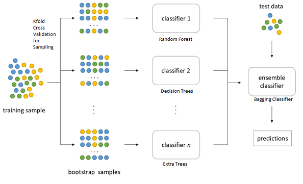

# Ensemble-Learning

Random Forest -> Birden fazla Decision Tree'den oluşan bir ensemble learning algoritmasıdır.

Veri seti  train ve test olarak ayrıldıktan sonra, train veri setinden seçilen veriler subset'ler olarak ayırılır. Bu işleme Bootstrapping denilir. Daha sonra her subset için bir Decision Tree Classifier kullanılır. n adet eğitilmiş Decision Tree, ensemble classifier'ı oluşturur. Test veri setine ensemble classifier yani içerideki n adet Decision Tree uygulanır ve her bir tree'den bir sonuç elde edilir. Elde edilen sonuçlarda en çok çıkan sınıf test verisinin sınıfını belirler. Bu işleme Aggregating denilir. Tüm bu adımların genel adı BAGGING olarak belirlenmiştir. 
